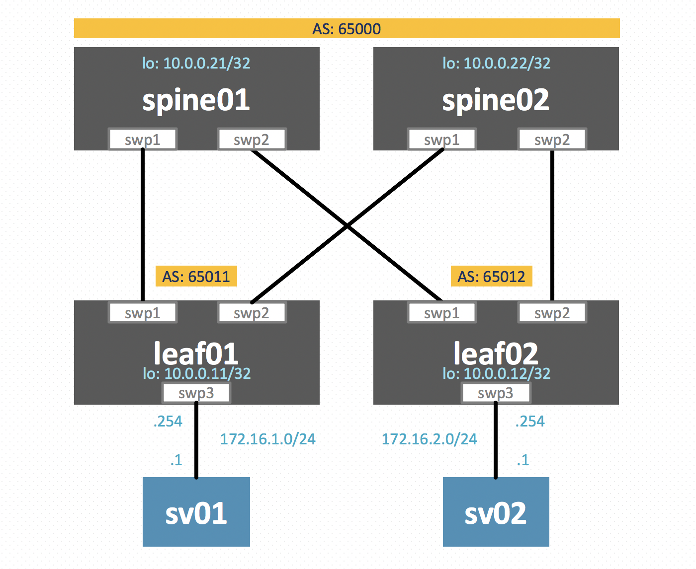

# 「BGP Unnumbered で遊んでみた」 デモ環境

## 概要

「[BGP Unnumbered で遊んでみた](https://www.slideshare.net/akira6592/bgp-233482295/akira6592/bgp-233482295)」のでもで利用した環境の Vagrantfile です。


## 構成図



## 起動方法
```sh
vagrant up
```

## 動作確認例

起動直後は、4台間ですべて BGP ネイバーを張っている状態になります。

### leaf02

BPG ネイバーとルーティングテーブル確認

```
$ vagrant ssh leaf02
Linux leaf02 4.19.0-cl-1-amd64 #1 SMP Cumulus 4.19.94-1+cl4u3 (2020-03-05) x86_64

Welcome to Cumulus VX (TM)

Cumulus VX (TM) is a community supported virtual appliance designed for
experiencing, testing and prototyping Cumulus Networks' latest technology.
For any questions or technical support, visit our community site at:
http://community.cumulusnetworks.com

The registered trademark Linux (R) is used pursuant to a sublicense from LMI,
the exclusive licensee of Linus Torvalds, owner of the mark on a world-wide
basis.
Last login: Sun May 10 06:04:07 2020 from 10.0.2.2
vagrant@leaf02:mgmt:~$ sudo vtysh 

Hello, this is FRRouting (version 7.0+cl4u3).
Copyright 1996-2005 Kunihiro Ishiguro, et al.

leaf02# show ip bgp summary 

IPv4 Unicast Summary:
BGP router identifier 10.0.0.12, local AS number 65012 vrf-id 0
BGP table version 8
RIB entries 11, using 2024 bytes of memory
Peers 2, using 41 KiB of memory
Peer groups 1, using 64 bytes of memory

Neighbor        V         AS MsgRcvd MsgSent   TblVer  InQ OutQ  Up/Down State/PfxRcd
spine01(swp1)   4      65000     335     339        0    0    0 00:16:27            3
spine02(swp2)   4      65000     332     335        0    0    0 00:16:20            3

Total number of neighbors 2
leaf02# show ip route 
Codes: K - kernel route, C - connected, S - static, R - RIP,
       O - OSPF, I - IS-IS, B - BGP, E - EIGRP, N - NHRP,
       T - Table, v - VNC, V - VNC-Direct, A - Babel, D - SHARP,
       F - PBR, f - OpenFabric,
       > - selected route, * - FIB route, q - queued route, r - rejected route

B>* 10.0.0.11/32 [20/0] via fe80::a00:27ff:fea2:9e50, swp1, 00:16:24
  *                     via fe80::a00:27ff:fecd:a9c6, swp2, 00:16:24
C>* 10.0.0.12/32 is directly connected, lo, 00:16:35
B>* 10.0.0.21/32 [20/0] via fe80::a00:27ff:fea2:9e50, swp1, 00:16:31
B>* 10.0.0.22/32 [20/0] via fe80::a00:27ff:fecd:a9c6, swp2, 00:16:24
B>* 172.16.1.0/24 [20/0] via fe80::a00:27ff:fea2:9e50, swp1, 00:16:24
  *                      via fe80::a00:27ff:fecd:a9c6, swp2, 00:16:24
C>* 172.16.2.0/24 is directly connected, swp3, 00:16:35
leaf02# 
```


### sv02

`sv01` への疎通確認

```
$ vagrant ssh sv02
[vagrant@sv02 ~]$ ping 172.16.1.1 -c 4
PING 172.16.1.1 (172.16.1.1) 56(84) bytes of data.
64 bytes from 172.16.1.1: icmp_seq=1 ttl=61 time=1.41 ms
64 bytes from 172.16.1.1: icmp_seq=2 ttl=61 time=1.84 ms
64 bytes from 172.16.1.1: icmp_seq=3 ttl=61 time=1.50 ms
64 bytes from 172.16.1.1: icmp_seq=4 ttl=61 time=1.92 ms

--- 172.16.1.1 ping statistics ---
4 packets transmitted, 4 received, 0% packet loss, time 11ms
rtt min/avg/max/mdev = 1.405/1.666/1.919/0.216 ms
```

## 想定環境 
- Virtual Box 6.0.14
- Vagrant 2.2.8